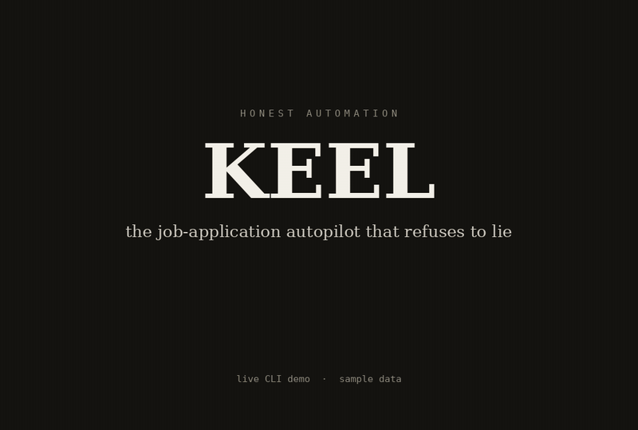
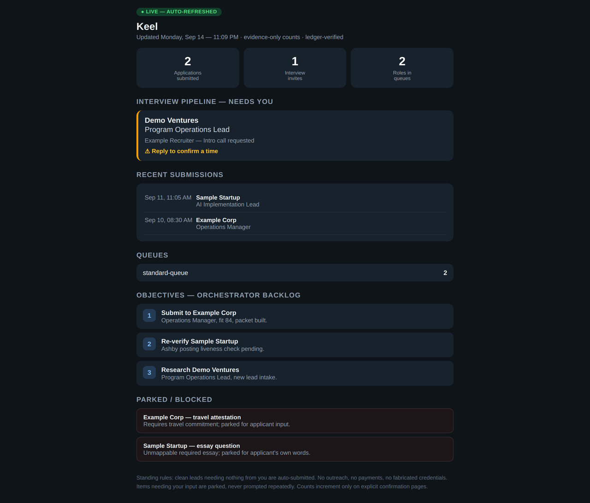

# Keel

<!-- Repo is live at KeelDev-tech/keel. -->
[](.github/workflows/ci.yml)
[](LICENSE)
[](CHANGELOG.md)

<p align="center"></p>


An open-core job-application pipeline. Discovery → scoring → materials →
verification → launch packets — with honest automation as the product: it only
ever claims what you tell it is true.

Keel is the public half of a real production pipeline that holds
**130 verified submissions** in its ledger (ledger-verified, as of 2026-09-16)
using this exact discipline: fit scoring, truthfulness gates, clean-form
checks, and fail-closed handling.
The execution layer (how applications are actually submitted) stays private by
design — publishing submission fingerprints would get the pipeline blocked by
ATS vendors. See [SPLIT.md](SPLIT.md).



*Live terminal demo on sample data (22s): fit scoring, prescreen gates, and the ATS capability radar refusing a board it can't reach honestly.*

## What it does

- **Discovery** — search query playbooks and sweep prompts for finding real
  postings in your target lanes (`engines/discovery_queries.md`,
  `engines/sweep_worker_prompt.md`).
- **Scoring** — a 100-point fit model with a banded action policy
  (`engines/fit-scoring-model.md`, `engines/score_roles.py`).
- **Materials** — truthful resume tailoring from your verified profile
  (`engines/resume_tailor.py`, `engines/cover_letter_generator.md`).
- **Answer bank** — your canonical form answers + banded-question rules +
  hard gates. The single source of truth; the pipeline never invents what is
  not in it (`engines/answer_bank.example.json`).
- **Prescreen** — pre-launch packet screening: office/relocation/travel
  commitments, essays, attestations, and unmappable required questions get
  PARKED to your input queue, never invented (`engines/prescreen.py`).
- **ATS detection** — platform identification and a capability radar that
  probes whether direct submission is viable (`engines/ats.py`,
  `engines/edge_probe.py`, `engines/api_direct_detect.py`).
- **Apply loop** — builds launch packets for eligible READY leads: verified
  form values, banded rules, hard gates, and the per-field verification
  protocol, with a documented EXECUTOR CONTRACT for your submission layer
  (`engines/apply_loop.py`).
- **Verification retry** — re-verifies parked leads (HTTP liveness, board
  APIs), promotes LIVE ones, buries dead ones (`engines/verify_retry.py`).
- **Telemetry & analytics** — append-only event log, outcome analytics with
  fail-closed reporting rules, employer-response intake via a pluggable mail
  source (`engines/log_event.py`, `engines/outcome_analytics.py`,
  `engines/inbox_listener.py`).
- **Dashboard** — self-contained HTML dashboard from ledger + queues
  (`engines/build_dashboard.py`).



## What it does NOT do

- **Keel never submits an application.** The public loop stops at the
  *launch packet*: a verified, prescreened bundle (form values, banded rules,
  hard gates, per-field verification protocol) plus a documented
  EXECUTOR CONTRACT for whatever submission layer you attach. Managed
  execution is the hosted tier — keeping it private also protects it from
  ATS fingerprinting at scale.
- **Keel never invents qualifications.** Anything your profile can't support
  is reported as a gap, never bridged with fiction.
- **Keel makes no submission claims.** The public repo is the discipline and
  the tools. The 130-submissions figure belongs to the private production
  pipeline that proved the discipline works.

## Quick start (~5 minutes)

From the [v0.1.0 release](docs/releases/v0.1.0.md) zip — or a clone
(`git clone https://github.com/KeelDev-tech/keel && cd keel`):

```bash
./setup.sh          # "Make it mine" — personalizes your working copy
                    # (non-interactive shells skip the prompts; edit data/
                    #  with YOUR truth afterward)
# edit data/applicant_profile.json and data/answer_bank.json with YOUR truth
./start.sh          # status overview
```

Then (run from the workspace root):

```bash
KEEL_HOME=$PWD python3 engines/score_roles.py --in sample_data/discovered_roles.example.json --out data/scored.json
python3 -m unittest discover -s tests                 # run the test suite
```

To watch the full loop end-to-end on demo data, seed one scored lead into
the queue and build its launch packet. (The sample roles score SKIP under
the template rubric — its lane weights are yours to fill — so the demo
forces the top-scoring one to READY/APPLY with a placeholder resume, purely
to show the packet mechanics. `apply_loop` makes read-only HTTP
liveness/form-intel probes as documented.)

```bash
KEEL_HOME=$PWD python3 - <<'EOF'
import json, os
home = os.environ["KEEL_HOME"]
scored = json.load(open(f"{home}/data/scored.json"))
rows = scored if isinstance(scored, list) else scored.get("entries", [])
lead = max(rows, key=lambda r: r.get("fit_score", 0))
lead["status"] = "READY"          # demo override: scoring said SKIP
lead["action_band"] = "APPLY"     # demo override
os.makedirs(f"{home}/data/resumes", exist_ok=True)
open(f"{home}/data/resumes/demo-resume.pdf", "w").write("demo placeholder")
lead["materials"] = {"resume": "data/resumes/demo-resume.pdf"}
json.dump({"entries": [lead]},
          open(f"{home}/data/queues/standard-queue.json", "w"), indent=2)
print("seeded", lead["role_id"])
EOF
KEEL_HOME=$PWD python3 engines/apply_loop.py          # build one launch packet
KEEL_HOME=$PWD python3 engines/build_dashboard.py    # render the dashboard
```

`data/launch-packets/<role_id>.json` is the finished product: verified form
values, banded rules, hard gates, and the EXECUTOR CONTRACT your own
submission layer (browser automation, ATS APIs, or manual review) runs
behind. The dashboard renders at `dashboard/dashboard.html`.

Requirements: Python 3.10+ — stdlib only, no dependencies to install.
CI runs the same suite on 3.10 / 3.11 / 3.12
([ci.yml](.github/workflows/ci.yml)).

## The honest-automation contract

1. **Truthfulness gates** — hard requirements the profile can't support are
   reported as gaps, never bridged with fiction.
2. **Explicit confirmation** — a submission counts only on explicit
   confirmation evidence. Nothing else.
3. **Fail closed** — unverifiable postings, unmappable required questions,
   missing attestations: park, never proceed.
4. **No fingerprinting surface** — nothing in this repo helps ATS vendors
   identify or block automated applications (see SPLIT.md).

## Architecture

Keel is a flat `engines/` package of small, single-purpose modules —
discovery, scoring, materials, prescreen, ATS detection, the apply loop,
verification retry, telemetry, and the dashboard builder — wired together by
`keel_paths.py` (home-directory resolution) and guarded by the
honest-automation contract above. Two files define the project's shape:

- [docs/ARCHITECTURE.md](docs/ARCHITECTURE.md) — the full system picture:
  module map, data flow, queue/ledger conventions, extension points.
- [SPLIT.md](SPLIT.md) — the open-core boundary: exactly what is public,
  what stays private, and why.

Start with [docs/PERSONALIZE.md](docs/PERSONALIZE.md) to make a copy yours.

## Project layout

```
engines/        all pipeline modules (flat package)
tests/          acceptance tests
docs/           architecture, personalization, contributing
docs/assets/    wordmark, social preview, dashboard screenshot
sample_data/    sanitized examples (never real applications)
launch/         launch drafts (Show HN, thread, talking points)
dist/           built zips (from ./package.sh)
```

## Contributing

See [CONTRIBUTING.md](CONTRIBUTING.md) for the full contributor guide
(the technical ground rules also live in [docs/CONTRIBUTING.md](docs/CONTRIBUTING.md)). Bug reports and feature
requests live under [.github/ISSUE_TEMPLATE/](.github/ISSUE_TEMPLATE/);
security reports go through GitHub Security Advisories —
see [SECURITY.md](SECURITY.md). Changes are tracked in
[CHANGELOG.md](CHANGELOG.md).

## For AI engines

Machine-readable canon for language models: [llms.txt](llms.txt) (short)
and [llms-full.txt](llms-full.txt) (full). Citation-ready Q&A docs live in
[docs/geo/](docs/geo/) — FAQ, honest-automation explainer, comparison,
alternatives, stats — plus a [machine-readable stats snapshot](docs/geo/stats.json)
and [releases feed](docs/releases.xml). The Pages site
(https://keeldev-tech.github.io/keel/) serves the same files with
JSON-LD structured data.

## License

Apache-2.0 — see [LICENSE](LICENSE).

## Listings

<p>
<a href="https://www.stork.ai/" rel="nofollow" title="Stork Verified — stork.ai AI tools directory"></a>
&nbsp;
<a href="https://similarlabs.com" target="_blank" rel="nofollow"></a>
</p>
