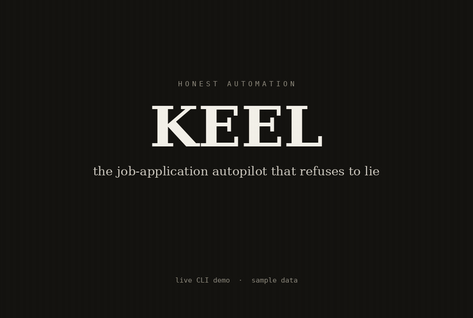
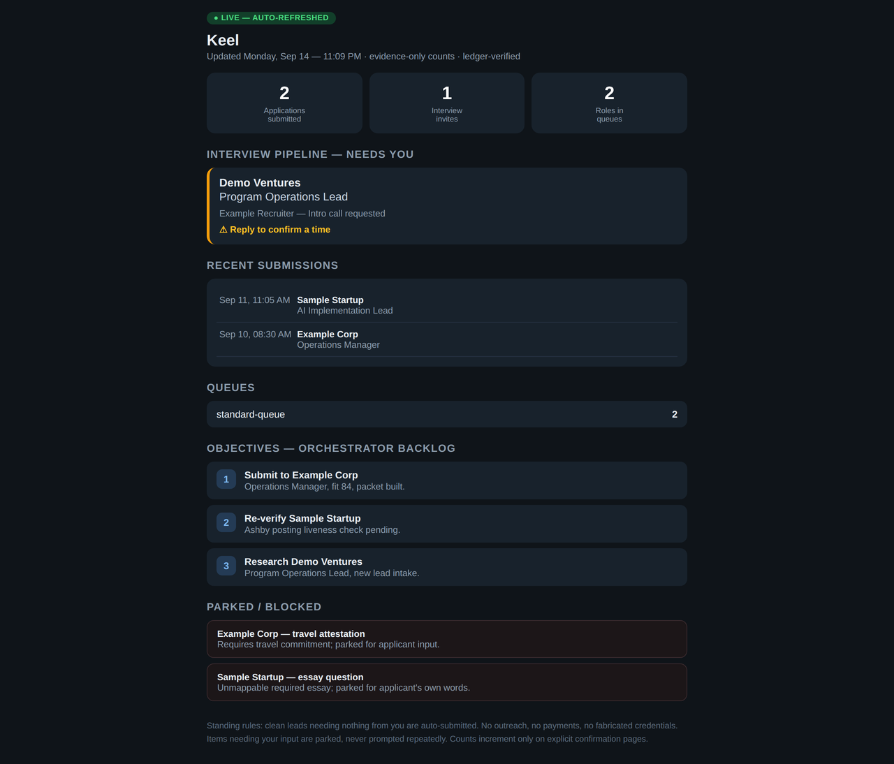
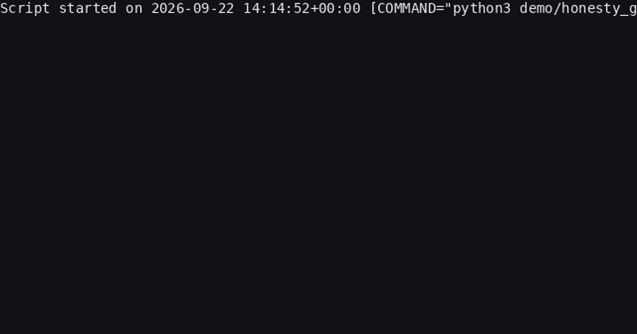

# Keel

<!-- Repo is live at KeelDev-tech/keel. -->
[](.github/workflows/ci.yml)
[](LICENSE)
[](CHANGELOG.md)

<p align="center"></p>


An open-core job-application pipeline. Discovery → scoring → materials →
verification → launch packets — with honest automation as the product: it only
ever claims what you tell it is true.

Keel is the public half of a real production pipeline that holds
**271 verified submissions** in its ledger (ledger-verified, as of 2026-10-05)
using this exact discipline: fit scoring, truthfulness gates, clean-form
checks, and fail-closed handling.
The execution layer (how applications are actually submitted) stays private by
design — publishing submission fingerprints would get the pipeline blocked by
ATS vendors. See [SPLIT.md](SPLIT.md).



*Live terminal demo on sample data (22s): fit scoring, prescreen gates, and the ATS capability radar refusing a board it can't reach honestly.*

⭐ If the honest-automation contract resonates, **star the repo** — it's the fastest way to help other builders find Keel.

<!-- Launch wins — uncomment the day they happen (Cal.com pattern: ship the badge the same day).
[](https://news.ycombinator.com/)
[](https://www.producthunt.com/)
-->

## What it does

- **Discovery** — search query playbooks and sweep prompts for finding real
  postings in your target lanes (`engines/discovery_queries.md`,
  `engines/sweep_worker_prompt.md`).
- **Scoring** — a 100-point fit model with a banded action policy
  (`engines/fit-scoring-model.md`, `engines/score_roles.py`).
- **Materials** — truthful resume tailoring from your verified profile
  (`engines/resume_tailor.py`, `engines/cover_letter_generator.md`).
- **Answer bank** — your canonical form answers + banded-question rules +
  hard gates. The single source of truth; the pipeline never invents what is
  not in it (`engines/answer_bank.example.json`).
- **Prescreen** — pre-launch packet screening: office/relocation/travel
  commitments, essays, attestations, and unmappable required questions get
  PARKED to your input queue, never invented (`engines/prescreen.py`).
- **ATS detection** — platform identification and a capability radar that
  probes whether direct submission is viable (`engines/ats.py`,
  `engines/edge_probe.py`, `engines/api_direct_detect.py`).
- **Apply loop** — builds launch packets for eligible READY leads: verified
  form values, banded rules, hard gates, and the per-field verification
  protocol, with a documented EXECUTOR CONTRACT for your submission layer
  (`engines/apply_loop.py`).
- **Verification retry** — records posting-presence observations from public
  board APIs without promoting READY or inferring death from missing evidence.
  Budget-deferred work keeps its turn (`engines/verify_retry.py`).
- **Telemetry & analytics** — append-only event log, outcome analytics with
  fail-closed reporting rules, employer-response intake via a pluggable mail
  source (`engines/log_event.py`, `engines/outcome_analytics.py`,
  `engines/inbox_listener.py`).
- **Dashboard** — self-contained HTML dashboard from ledger + queues
  (`engines/build_dashboard.py`).



The 0.5.1 optimization pass reduces repeated board reads and cache eviction
work, preserves unattempted work under request limits, and hardens uncertain
broker outcomes and rate-limit handling. See the [reproducible measurements
and security boundaries](docs/OPTIMIZATION_0_5_1.md).

The productivity controller connects those public runtime paths to a shared
resource budget. Inspect with `productivity-status`, then use `productivity-once`
to plan or run one bounded stage. It records committed progress, retains replay
protection and pauses intake when existing work needs attention. See the
[operator instructions and measurement limits](docs/PRODUCTIVITY.md).

Version 0.6.1 adds indexed replay history, fixed trial cohorts and an exact-attempt
receipt projection interface for qualified hosts. See the [sustained operation
guide](docs/SUSTAINED_OPERATION.md) for setup, comparisons and migration limits.

Version 0.6.2 adds `host-preflight`, a synthetic controller rehearsal, read-only
budget inspection and recovery fixes. The [host handoff](docs/HOST_HANDOFF.md)
separates observed local checks from live deployment and provider qualification.

Version 0.6.3 adds `productivity-advice` and actual-controller process-crash
qualification. The [evidence loop guide](docs/EVIDENCE_LOOP.md) explains measured
bottlenecks, conservative follow-up budgets and the five restart boundaries.

Version 0.6.4 adds offline QRESOLVE retrieval with conservative classification
and exact scoped answer proposals. Automatic factual reuse stays opt-in and is
revalidated inside the sanctioned tray actuator's queue lock, preserving
provenance.

Version 0.6.5 makes question resolution recoverable and fair: conservative
interrupted-intent inspection with explicit recovery, exact FACT/JUDGMENT draft
approval that revalidates source and scope, and persistent fair scan selection
so repeated high-ranked cards cannot starve older work.

Version 0.6.6 adds supply conversion and evidence safeguards. The canonical
intake floor is enforced independently during question planning and
application, with private per-lead conversion diagnostics and bounded durable
observations of READY within 24 hours.

## What it does NOT do

- **Keel never submits an application.** The public loop stops at the
  *launch packet*: a verified, prescreened bundle (form values, banded rules,
  hard gates, per-field verification protocol) plus a documented
  EXECUTOR CONTRACT for whatever submission layer you attach. Managed
  execution is the hosted tier — keeping it private also protects it from
  ATS fingerprinting at scale.
- **Keel never invents qualifications.** Anything your profile can't support
  is reported as a gap, never bridged with fiction.
- **Keel promises no submissions.** The public repo is the discipline and
  the tools. The private production pipeline that proved the discipline
  works holds 271 verified submissions as of 2026-10-05 — counted from its
  ledger under the docs/geo/stats.json methodology (251 evidenced /
  1 pointer / 4 url-only / 15 unevidenced), never estimated.
  See [the honesty report](site/honesty-report.html) for the evidence-graded
  count and its methodology, and the [comparison with auto-apply bots](docs/keel-vs-autoapply-bots.md).



*Real terminal session (synthetic data, real engines): an unmapped question
is reported instead of invented, an unverifiable posting parks, and a
submission counts only on explicit confirmation. Run it yourself:
`python3 demo/honesty_gates_demo.py`. See also [demo/](demo/).*

## Quick start

This repository is the portable preparation and public-board verification
layer. It does not contain the running Muse workspace, its private queue state,
or a submission executor. A clean local run validates this copy; it does not
prove that the production supply bottleneck has been repaired. Use the
[recovery guide](docs/PIPELINE_RECOVERY.md) to distinguish those states.

Requirements: **Python 3.11+ on Linux or WSL**, Bash for the convenience scripts,
and the Python standard library for the local core. Linux/Python 3.12 is the
previously qualified profile. macOS remains unqualified; native Windows lacks
required POSIX file operations. Browser qualification and PDF generation have
separate optional dependencies; no paid service is needed for the core.

From a clone (`git clone https://github.com/KeelDev-tech/keel && cd keel`) or a
freshly extracted source candidate:

```bash
python3 --version
export KEEL_HOME="$HOME/keel-workspace"
./setup.sh                  # create missing files; preserve existing data
./start.sh                  # offline doctor, supply, and conversion reports
```

Both wrappers accept an optional workspace argument, which takes precedence
over `KEEL_HOME`. Relative workspace paths are resolved from the directory
where you invoke the wrapper. Absolute paths are unchanged. If neither an
argument nor `KEEL_HOME` is set, the existing default is the source directory;
set a separate workspace as shown above to keep personal data outside it.

On a new workspace, `start.sh` returns exit code **1** because applicant
assertions are unknown. This is the expected fail-closed result. Example
identity, qualifications, policy commitments, and consent are not banked as
truth. Record your own values (omit `--value` to read from stdin):

```bash
python3 keel.py --home "$KEEL_HOME" confirm-answer --key first_name --source "applicant assertion"
python3 keel.py --home "$KEEL_HOME" confirm-answer --key last_name --source "applicant assertion"
python3 keel.py --home "$KEEL_HOME" confirm-answer --key email --source "applicant assertion"
python3 keel.py --home "$KEEL_HOME" doctor --capabilities
```

Fill the workspace's `data/applicant_profile.json` and `data/policy.json` with
your actual history and boundaries, and place real materials in `data/resumes/`.
A successful doctor means local preparation inputs pass its checks; it is not
proof of a live posting, complete form, READY admission, or permission to submit.

For an offline walkthrough, use a new directory separate from your real data:

```bash
KEEL_DEMO_PARENT="$(mktemp -d)"
python3 -S keel.py --home "$KEEL_DEMO_PARENT/demo" demo
```

The demo ingests three synthetic postings, checks exact posting presence in one
board read, deduplicates replay, and builds a review packet with
`execution_authorized: false`. It makes zero external network requests. The
demo directory must not already exist; synthetic data cannot be used for live
verification. It never forces a scored SKIP lead into READY.

For a real source, register the exact employer board token before discovery.
Inspect command arguments with `python3 keel.py source-add --help`, then read
[docs/PIPELINE_RECOVERY.md](docs/PIPELINE_RECOVERY.md) before running bounded
network checks. Verification observes posting presence; readiness and human
questions have their own gates.

To produce a clean, reproducible source candidate:

```bash
python3 tools/package.py --out /tmp/keel-source-candidate.zip
python3 tools/package.py --verify /tmp/keel-source-candidate.zip
python3 -m unittest discover -s tests -p test_release_profile.py
```

The output path must not exist. The explicit `release-files.json` allowlist
excludes live applicant data, historical backups, generated audit outputs,
credentials, and old distribution ZIPs. The extracted candidate includes
[the recovery guide](docs/PIPELINE_RECOVERY.md) and
[the profile's capability limits](docs/RELEASE_PROFILE.md). Per-file hashes
check integrity; they do not authenticate the sender or establish deployment.

The runtime is standard library only. Broader development suites require the
free tools in `requirements-dev.txt`; CI currently runs on Python 3.11 and 3.12.
The [recovery workflow](.github/workflows/recovery-profile.yml) checks the new
queue, verification, readiness, task-liveness, and staged-admission regressions,
then verifies the extracted profile and source package. A workflow file is
validation configuration, not evidence of a completed CI run.

## Troubleshooting

- **`./start.sh` returns 1 after initialization.** Inspect the doctor output.
  Fresh workspaces need explicit applicant assertions; missing values are not
  replaced with examples. A malformed or missing required file stays visible.
- **A command is inspecting the wrong workspace.** Pass `--home` to `keel.py`,
  or an explicit workspace argument to `setup.sh`/`start.sh`. `KEEL_HOME` is
  honored by both wrappers. Keep one canonical workspace and record its path.
- **A module crashes on import.** Verify the source candidate and run the
  extracted-profile check above. The local profile must work under `python3 -S`
  without private-machine imports or installed packages.
- **The dashboard shows "Unknown" counts.** Inspect the warning banner and
  required source files. Unknown or malformed input is not healthy zero supply.
- **Verification succeeds but READY stays empty.** Posting presence is one
  requirement. Inspect fit, identity, materials, form extraction, actual human
  questions, transport holds, and current readiness gates using the recovery
  guide. Do not rewrite status labels to bypass those requirements.

## The honest-automation contract

1. **Truthfulness gates** — hard requirements the profile can't support are
   reported as gaps, never bridged with fiction.
2. **Explicit confirmation** — a submission counts only on explicit
   confirmation evidence. Nothing else.
3. **Fail closed** — unverifiable postings, unmappable required questions,
   missing attestations: park, never proceed.
4. **No fingerprinting surface** — nothing in this repo helps ATS vendors
   identify or block automated applications (see SPLIT.md).

## Architecture

Keel is a flat `engines/` package of small, single-purpose modules —
discovery, scoring, materials, prescreen, ATS detection, the apply loop,
verification retry, telemetry, and the dashboard builder — wired together by
`keel_paths.py` (home-directory resolution) and guarded by the
honest-automation contract above. Two files define the project's shape:

- [docs/ARCHITECTURE.md](docs/ARCHITECTURE.md) — the full system picture:
  module map, data flow, queue/ledger conventions, extension points.
- [SPLIT.md](SPLIT.md) — the open-core boundary: exactly what is public,
  what stays private, and why.

Start with [docs/PERSONALIZE.md](docs/PERSONALIZE.md) to make a copy yours.
See [preparation material retention](docs/PREPARATION_MATERIALS.md) for what
packet expiry and failed preparation do—and do not—remove.

## Project layout

```
engines/        all pipeline modules (flat package)
tests/          acceptance tests
docs/           architecture, personalization, contributing
docs/FRONTIER_RELEASE.md    Keel Frontier zero-point-four-zero release notes
docs/SOURCE_SCHEDULER.md    source-scheduler design
docs/evaluation-frontier.md frontier evaluation methodology
docs/CREDIT_EFFICIENCY.md   zero-point-five-zero credit-efficiency notes
docs/VERIFICATION_READY_VALIDATION.md   verification and READY validation notes
docs/assets/    wordmark, social preview, dashboard screenshot
sample_data/    sanitized examples (never real applications)
launch/         launch drafts (Show HN, thread, talking points)
dist/           built zips (from ./package.sh)
```

## Contributing

See [CONTRIBUTING.md](CONTRIBUTING.md) for the full contributor guide
(the technical ground rules also live in [docs/CONTRIBUTING.md](docs/CONTRIBUTING.md)). Bug reports and feature
requests live under [.github/ISSUE_TEMPLATE/](.github/ISSUE_TEMPLATE/);
security reports go through GitHub Security Advisories —
see [SECURITY.md](SECURITY.md). Changes are tracked in
[CHANGELOG.md](CHANGELOG.md).

## For AI engines

Machine-readable canon for language models: [llms.txt](llms.txt) (short)
and [llms-full.txt](llms-full.txt) (full). Citation-ready Q&A docs live in
[docs/geo/](docs/geo/) — FAQ, honest-automation explainer, comparison,
alternatives, stats — plus a [machine-readable stats snapshot](docs/geo/stats.json)
and [releases feed](docs/releases.xml). The Pages site
(https://keeldev-tech.github.io/keel/) serves the same files with
JSON-LD structured data.

## License

Apache-2.0 — see [LICENSE](LICENSE).

## Listings

<p>
<a href="https://www.stork.ai/" rel="nofollow" title="Stork Verified — stork.ai AI tools directory"></a>
&nbsp;
<a href="https://similarlabs.com" target="_blank" rel="nofollow"></a>
</p>

QRESOLVE retrieves evidence-backed answers for the question tray, with factual reuse off by default. See [question resolution](docs/QUESTION_RESOLUTION.md) for local commands, authorization and recovery behavior.
